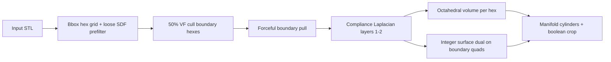

# Conformal Dual Hex Lattice (Route 3)

**Status:** **Default production hex mesh for Graphite** — validated on Toros (Jun 2026), reproduced on trophy base. This is the recipe to wire into the app, headless runners, and new part exports unless a project explicitly opts into an experimental variant.

Checkpoint: [`optimization/checkpoints/conformal-dual-hex-2026-05/`](../optimization/checkpoints/conformal-dual-hex-2026-05/CHECKPOINT.md).

This document is the canonical reference for **Conformal Dual**: VF-cropped conformal hex scaffold, compliance-layer Laplacian, octahedral interior volume, and **integer-mapped** surface dual skin (hex boundary face centers connected via quad adjacency).

**Not default (experimental / comparison only):** two-branch path skin, STL-native skin, shrink-only VF-gated dual, brute-force lofted grids, Kelvin/Tesseract interior rules — see [TROPHY_BASE_HEX_NEXT.md](TROPHY_BASE_HEX_NEXT.md) for trophy-side experiments.

---

## Architecture overview



| Layer | Module | Function |
|-------|--------|----------|
| Scaffold | `hex_scaffold_module.py` | `generate_conformed_hex_scaffold(..., conformal_dual_mode=True)` |
| Synthesis | `hex_scaffold_module.py` | `synthesize_conformal_dual_lattice(hex_elements)` |
| Geometry | `geometry_module.py` | `generate_geometry(..., crop_to_boundary=True)` |
| Policy | `boundary_policy.py` | EDT SDF, tiered pull, VF sampling, Laplacian |

**Public API:** `graphite.explicit.generate_conformed_hex_scaffold`, `graphite.explicit.synthesize_conformal_dual_lattice` (lazy imports in `graphite/explicit/__init__.py`).

### Wiring into Graphite

| Surface | Status |
|---------|--------|
| Scripts / API | **Ready** — use export scripts as templates |
| `graphite.explicit` package | **Exported** — lazy wrappers on scaffold + synthesis |
| Streamlit `app.py` | **Not wired** — legacy Gmsh/cropped hex only; Conformal Dual is the target for new UI work |
| `scripts/generate_lattice.py` | **Not wired** — explicit branch still uses cropped hex + generic topology |

---

## Required scaffold flags (production)

These settings are **mandatory** for organic parts; omitting VF cull caused ~400 exterior hexes to be snapped onto the surface (“pancaking”) and hundreds of inversion warnings.

```python
hexes, report = generate_conformed_hex_scaffold(
    mesh,
    target_element_size=cell_size,
    grid_anchor="bbox_center",
    conformal_dual_mode=True,
    shrink_wrap_relax=False,
    neighbor_stretch=False,
    boundary_stretch_out=False,
    cull_mostly_external_hexes=True,   # 50% VF on boundary band
    laplacian_iterations=5,
    laplacian_alpha=0.4,
)
```

| Flag | Value | Why |
|------|-------|-----|
| `conformal_dual_mode` | `True` | Pull-only snap + layers 1–2 compliance smooth |
| `cull_mostly_external_hexes` | `True` | Drop boundary hexes with ≤50% volume inside |
| `neighbor_stretch` | `False` | Do not regrow into culled cells |
| `boundary_stretch_out` | `False` | No outward stretch blend |
| `shrink_wrap_relax` | `False` | Use compliance layers, not full frozen-boundary shrink-wrap |

---

## Synthesis (integer surface dual)

```python
nodes, volume_struts, dual_skin_struts, report = synthesize_conformal_dual_lattice(hexes)
merged_struts = union(volume_struts, dual_skin_struts)  # dedupe by node pair
mesh, vol = generate_geometry(nodes, merged_struts, radius, boundary_mesh=mesh, crop_to_boundary=True)
```

**Steps inside `synthesize_conformal_dual_lattice`:**

1. `generate_hex_octahedral_volume_with_boundary_face_map` → volume struts + `boundary_face_to_node[(hex_idx, face_idx)]`.
2. `build_boundary_quad_topology` + `get_boundary_quad_adjacency`.
3. For each adjacent boundary quad pair: map quads to hex faces → global face-center node IDs → skin strut.
4. Return **unmerged** `volume_struts` and `dual_skin_struts` for isolated diagnostics.

Skin struts use **standard cylinders** (not ribbon mesh) in current exports.

---

## Toros reference results (Phase 17)

| Metric | Broken (no VF cull) | Fixed (VF cull) |
|--------|---------------------|-----------------|
| Kept hexes | 1,120 | **704** |
| `inversion_warning_hexes` | 568 | **136** |
| Merged struts | 15,136 | **9,704** |
| Merged STL watertight | Yes | **Yes** |

**Artifacts:** `outputs/Route3_ConformalDual_Fixed_Toros.stl` (primary), optional `*_SkinOnly.stl`, `*_CoreOnly.stl`.

**Script:** `scripts/export_route3_conformal_dual_toros.py`

---

## Diagnostic scripts

| Script | Purpose |
|--------|---------|
| `scripts/export_deformation_stages.py` | `scripts/archive/exports/` — hex wireframe stage STLs |
| `scripts/export_route3_conformal_dual_toros.py` | Full lattice merged + skin/core splits |

Wireframe exports use `hex_scaffold_edge_graph` (12 edges per hex), `strut_radius=0.05`, uncropped.

---

## Alternative skin: STL-native path

For **coarse / flat** CAD (e.g. trophy base cuboid), `stl_surface_skin.py` builds skin on **triangle centroids → edge mid → centroid** and bridges to hex face centers via **cKDTree** (`synthesize_hex_volume_with_stl_surface_skin`).

| Aspect | Conformal Dual (integer) | STL-native skin |
|--------|--------------------------|-----------------|
| Skin domain | Hex boundary quads | STL triangles |
| Bridge | Quad adjacency + face map | Nearest skin node after projecting face center |
| Best for | Curved organic (Toros) | Coarse planar regions |

See `scripts/archive/exports/export_trophy_base_thin_stl_skin.py` (legacy shrink-only scaffold).

**Surface-hugging decoupled skin (recommended for curved / stair-step issues):**

- `synthesize_hex_volume_with_stl_surface_skin_decoupled` — STL skin separate from core; cKDTree bridges
- `scripts/archive/exports/export_trophy_base_thin_decoupled_stl_skin.py` — half cell size + refined STL skin mesh

Next work: [`docs/TROPHY_BASE_HEX_NEXT.md`](TROPHY_BASE_HEX_NEXT.md).

---

## Related modules (audit)

- `hex_surface_dual.py` — boundary quads, `on_surface_paths` (hex-skin analogue of STL path)
- `stl_surface_skin.py` — STL triangle skin + `merge_volume_with_stl_surface_skin`
- `boundary_policy.py` — shared snap, VF, Laplacian

**Adapter / Delaunay Kagome** (`scripts/run_adapter_lattice.py`) is a **separate** tet GMSH pipeline with `surface_dual` cage on mesh triangles — not Conformal Dual.

---

## Lessons learned

1. **VF cull is not optional** for Route 3 on bbox grids; exterior “air” hexes destroy conformity when snapped.
2. **Inversion warnings** are post-deformation Jacobian checks; compare against deformation-stage STLs before blaming synthesis.
3. **Integer dual** avoids spatial bridge ambiguity but requires a consistent hex boundary after snap.
4. Deformation diagnostics should use the **same** `cull_mostly_external_hexes=True` as production exports.
