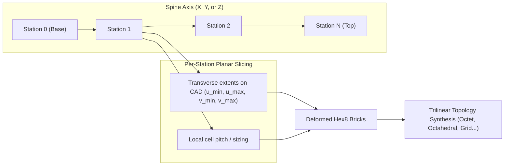

# Lofted Grading & Explicit Lofted Hex Engine

**Status:** Production Core in `graphite/explicit/lofted_scaffold.py` (GMSH-free, multi-axis $X/Y/Z$, multi-topology).  
**Related Docs:** [MULTI_LATTICE_BLENDING.md](MULTI_LATTICE_BLENDING.md), [HEX_EXPLICIT_ENGINE.md](HEX_EXPLICIT_ENGINE.md), [IMPLICIT_GRADING_AND_TEXTURES.md](IMPLICIT_GRADING_AND_TEXTURES.md)

---

## 1. Motivation & Overview

Standard Cartesian conformal lattices fill a part's bounding box with a regular grid and trim or deform boundary cells against the CAD skin. For many functional parts — such as **tapered struts, prosthetic implants, turbine blades, brackets, and trophy bases** — the part's primary structural axis does not align with a constant cross-section.

Rather than forcing a uniform grid that stair-steps through a taper, **Lofted Grading** deforms the cellular scaffold along a designated **spine axis**:
1. Select a **spine direction** (the loft axis, e.g. $X, Y,$ or $Z$).
2. March along the spine at discrete **stations** (uniform or graded spacing).
3. At each station, compute the exact transverse cross-sectional extents on the CAD mesh via planar triangle slicing.
4. Assemble a structured $N_u \times N_v \times N_w$ grid of deformed hexahedral elements whose lateral dimensions naturally track the taper of the part.
5. Synthesize cellular topology into each deformed brick using trilinear shape functions.



---

## 2. Production API (`graphite/explicit/lofted_scaffold.py`)

The production lofted engine is 100% GMSH-free and exposed through `graphite.explicit`:

```python
from graphite.explicit.lofted_scaffold import (
    generate_lofted_hex_scaffold,
    synthesize_lofted_lattice,
)

# 1. Generate boundary-conforming structured hex scaffold
vol_hexes, skin_hexes, report = generate_lofted_hex_scaffold(
    mesh,
    nx=8,
    ny=4,
    nz=4,
    spine_axis="y",              # 'x', 'y', or 'z' (case-insensitive)
    station_coords=None,         # Optional custom 1D station positions along spine
    snap_surface_nodes=False,    # Optional closest-point surface projection
)

# 2. Synthesize lattice topology into deformed bricks via trilinear mapping
nodes, struts, report = synthesize_lofted_lattice(
    vol_hexes,
    rule_name="octet",           # 'octet', 'octahedral', 'grid', 'cross', 'star', 'kelvin14'
    topology_round_decimals=6,
)
```

### Backwards Compatibility
Existing scripts importing `generate_brute_force_fixed_grid_hex_scaffold` from `graphite.explicit.hex_scaffold_module` route directly to the new engine with full argument parity.

---

## 3. Supported Cellular Rules

Because `synthesize_lofted_lattice` evaluates unit cell topology in normalized $(u, v, w) \in [0, 1]^3$ parameter space and maps it via the hex element's trilinear basis:

$$\mathbf{x}(u, v, w) = \sum_{i=1}^8 N_i(u, v, w) \mathbf{x}_i$$

all registered modular SC rules in Graphite are supported natively:

| Rule Name | Internal Hubs | Node Roles | Recommended Usage |
|:----------|:--------------|:-----------|:------------------|
| **`octet`** | Corner + Face Centers | $C, F$ | High specific stiffness, stretch-dominated load paths |
| **`octahedral`** | Face Centers | $F$ | Bending-dominated, compliant energy dissipation |
| **`grid`** | Corners | $C$ | Clean rectilinear frames, open transport channels |
| **`cross`** | Face Diagonals | $C, F$ | High torsional and shear resistance |
| **`star`** | Body Center + Corners | $B, C$ | Negative Poisson / auxetic tendencies |
| **`kelvin14`** | Truncated Octahedron | $K$ | Isotropic open-cell foam approximations |

---

## 4. Verification & Benchmarking

- **Automated Pytest Suite:** [`tests/test_lofted_scaffold.py`](../tests/test_lofted_scaffold.py)
  - Validates spine axes $X, Y, Z$ on tapered solids.
  - Verifies strictly positive element Jacobian volumes ($\det(J) > 0$).
  - Validates multi-rule synthesis (`grid`, `octahedral`, `octet`).
  - Verifies regression-free execution on real fixture [`test_parts/Trophy_base_thin.STL`](../test_parts/Trophy_base_thin.STL).
- **Review Export Script:** [`scripts/export_lofted_review.py`](../scripts/export_lofted_review.py)
  - Exports solid watertight STLs and isometric PNG renders to `outputs/lofted_review/`.

---

## 5. Identified Capability Gaps & Enhancement Roadmap

While the Cartesian-spine lofted engine is robust and fast, advanced aerospace, medical, and consumer hardware often present geometric requirements that motivate further expansion:

### Gap 1: Curved / Polyline Spines (Frenet-Serret Frame Lofting)
* **Current Limitation:** The spine axis must be parallel to world $X, Y,$ or $Z$.
* **Impact:** Curved geometries (e.g. curved pipe elbows, turbine blade cambers, anatomical hooks, C-clamps) cannot be lofted along their neutral axis without shearing cells.
* **Proposed Enhancement:** Accept a 3D polyline or B-spline curve $\mathbf{r}(s) = (x(s), y(s), z(s))$. At each station $s_k$, compute the local tangent $\mathbf{T}$, normal $\mathbf{N}$, and binormal $\mathbf{B}$ vectors (Frenet-Serret or rotation-minimizing frame), and slice the CAD mesh along the local transverse plane spanned by $(\mathbf{N}, \mathbf{B})$.

### Gap 2: Boundary-Conforming 2D Transverse Cross-Sections (TFI / Harmonic Warping)
* **Current Limitation:** At each station $s_k$, the cross-section is approximated by an axis-aligned bounding rectangle $[u_{\min}, u_{\max}] \times [v_{\min}, v_{\max}]$.
* **Impact:** If the cross-section is round, elliptical, or aerodynamic, the rectangular grid leaves empty corners or protrudes outside the CAD skin.
* **Proposed Enhancement:** Extract the actual 2D perimeter polygon $\mathcal{P}(s_k)$ from the plane-triangle intersection, and use **Transfinite Interpolation (TFI)** or 2D Laplacian smoothing to warp the interior $(N_u \times N_v)$ grid so that its boundary nodes conform directly to $\mathcal{P}(s_k)$.

### Gap 3: Equal-Phase Station Spacing from 1D Control Points
* **Current Limitation:** Stations are uniformly spaced along the spine coordinate ($dz = \text{const}$).
* **Impact:** Cannot continuously grade cell height $dz(s)$ to create fine cells at one end and coarse cells at the other without manual station array construction.
* **Proposed Enhancement:** Accept 1D control points $(s_i, L(s_i))$ specifying target unit-cell height along the spine. Integrate phase $W(s) = \int_{s_0}^s \frac{2\pi}{L(t)} \, dt$ to place stations at equal phase increments $\Delta W = 2\pi$, matching Graphite's implicit TPMS osteochondral grading math.

### Gap 4: Multi-Lattice Layering Along the Spine
* **Current Limitation:** The entire scaffold currently receives a single cellular rule across all layers.
* **Impact:** Cannot create functional zone transitions (e.g. stiff Octet base transitioning to compliant Octahedral tip) directly within the lofted scaffold call.
* **Proposed Enhancement:** Accept a per-station rule schedule `rule_schedule: list[str]`. Connect differing adjacent layers using the transition bridging strategies documented in [MULTI_LATTICE_BLENDING.md](MULTI_LATTICE_BLENDING.md) (automatic Octet buffer layers or internal $F \to C$ interface pyramids).

### Gap 5: Universal Surface Dual Integration for Lofted Scaffolds
* **Current Limitation:** Lofted grids currently synthesize volume lattice struts only; exterior skin duals require separate manual construction.
* **Proposed Enhancement:** Wire `sc_role_surface_dual.py` directly into the structured boundary quads of `lofted_scaffold.py`, giving lofted parts the same perimeter cage and diamond dual finish that Cartesian parts enjoy.

---

## 6. Summary Comparison: Lofted vs Cartesian vs Boundary-Driven

| Dimension | Standard Cartesian SC | Explicit Lofted SC (`lofted_scaffold.py`) | Boundary-Driven Dual-EDT |
|:---|:---|:---|:---|
| **Spine Alignment** | Axis-aligned bounding box | Follows part taper along spine ($X, Y, Z$) | Bi-directional between arbitrary surfaces |
| **Cross-Section** | Constant rectilinear pitch | Scaled per station slice | Interpolated across dual distance fields |
| **Cell Distortion** | Pure cubes $[0, L]^3$ | Trilinearly deformed hexahedra | High non-affine conformal distortion |
| **Skin Conformation** | Boolean / Nodal Conformation | Boundary-fitted stations + snap | Surface-distance isosurfaces |
| **Primary Fixtures** | Cylinders, cubes, bookends, wrist rests | Tapered wedges, trophy bases, ramps | Multi-inlet manifolds, custom osteochondral plugs |
