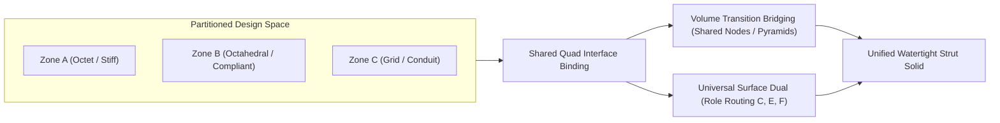

# Multi-Lattice Blending Architecture & Interfaces

**Status:** Specification & Reference Design  
**Module Alignment:** `graphite/explicit/` (`hex_topology_module.py`, `sc_role_surface_dual.py`, `lofted_scaffold.py`)  
**Related Docs:** [SURFACE_DUAL_ROLES.md](SURFACE_DUAL_ROLES.md), [HEX_EXPLICIT_ENGINE.md](HEX_EXPLICIT_ENGINE.md), [UNIVERSAL_DUAL_HANDOFF.md](UNIVERSAL_DUAL_HANDOFF.md)

---

## 1. Executive Summary & Motivation

In additive manufacturing of advanced structural components, a single monolithic lattice topology is rarely optimal for an entire part. Different functional zones require fundamentally different mechanical, thermal, or fluidic characteristics:

- **Structural Skins & Anchors:** High-stiffness, non-buckling trusses (e.g. **Octet-truss**, **Cross**) near load-bearing fixtures or exterior walls.
- **Energy Absorption & Crush Zones:** Bending-dominated or compliance-tuned cells (e.g. **Octahedral**, **Star**) in central cores to absorb impact without catastrophic shear localization.
- **Porous Fluid / Transport Conduits:** Open rectilinear channels (e.g. **Grid**, **Kelvin-14**) for unobstructed fluid flow or wiring passthroughs.
- **Directional Compliance:** Anisotropic topologies engineered to flex along one Cartesian axis while remaining rigid along others.

**Multi-lattice blending** is the capability to partition a single design space into multiple topological domains, assign different cellular rules to individual hexahedral elements, and bridge the interfaces between them seamlessly.

Graphite achieves this through its **Modular SC (Simple Cubic)** architecture: by grounding all explicit hex lattices in a shared reference parameter space $(u, v, w) \in [0, 1]^3$, topological transitions reduce to well-defined operations on shared interface quads.



---

## 2. Canonical Hex Cell Node Taxonomy (UVW Space)

Every cellular rule in `graphite/explicit/` is defined in normalized unit coordinates $(u, v, w) \in [0, 1]^3$ before being mapped to physical space via the hexahedron's trilinear shape functions:

$$\mathbf{x}(u, v, w) = \sum_{i=1}^8 N_i(u, v, w) \mathbf{x}_i$$

Nodes belonging to any topology fall into discrete geometric classifications based on where they reside within the unit cube:

| Role | Coordinates in $[0, 1]^3$ | Description | Representative Lattices |
|:----:|:-------------------------:|:------------|:------------------------|
| **C** | $u, v, w \in \{0, 1\}$ | **Corners** (8 per cell) | `grid`, `octet`, `cross`, `star`, `tesseract` |
| **E** | One coord $\in (0, 1)$, two $\in \{0, 1\}$ | **Edge midpoints** (12 per cell at 0.5) | Cut-cell midplane corners |
| **F** | Two coords $\in (0, 1)$, one $\in \{0, 1\}$ | **Face centers** (6 per cell at 0.5) | `octahedral`, `octet`, `cross`, `star` |
| **B** | $u = v = w = 0.5$ | **Body center** (1 per cell) | `star`, `octet` (variant), internal hubs |
| **K** | Truncated facet / off-axis positions | **Kelvin-type** polyhedral vertices | `kelvin14` |

### Node Presence per Registered Lattice Rule

| Lattice Rule | Outer Face Nodes | Internal Nodes | Primary Strut Types | Structural Behavior |
|:-------------|:-----------------|:---------------|:--------------------|:--------------------|
| **`grid`** | $4 \times \mathbf{C}$ | None | Edge chords ($C \to C$) | Orthotropic rectilinear frame |
| **`octahedral`** | $1 \times \mathbf{F}$ per face | None | Face-center chords ($F \to F$) | Bending-dominated, isotropic compliance |
| **`octet`** | $4 \times \mathbf{C}$, $1 \times \mathbf{F}$ | None | Diagonal chords ($C \to F$, $F \to F$) | Stretch-dominated, high specific stiffness |
| **`cross`** | $4 \times \mathbf{C}$, $1 \times \mathbf{F}$ | None | Face diagonals ($C \to F$) | High shear resistance |
| **`star`** | $4 \times \mathbf{C}$ | $1 \times \mathbf{B}$ | Body diagonals ($C \to B$) | Auxetic / negative Poisson tendencies |
| **`kelvin14`** | $4 \times \mathbf{K}$ (hex), $8 \times \mathbf{K}$ (sq) | None | Facet edges ($K \to K$) | Open-cell foam approximation |

---

## 3. Interface Compatibility Across Shared Faces

When two adjacent hexahedral elements $H_A$ and $H_B$ share an internal quad face $Q = H_A \cap H_B$, the compatibility of their load paths depends on the intersection of their node sets on $Q$:

$$\mathcal{S}_Q = \text{Nodes}(H_A) \cap Q, \qquad \mathcal{T}_Q = \text{Nodes}(H_B) \cap Q$$

### Compatibility Classes

```text
                  +----------------------------------------------+
                  |            Interface Compatibility           |
                  +----------------------+-----------------------+
                                         |
               +-------------------------+-------------------------+
               |                                                   |
      [Class 1: Shared Subsets]                           [Class 2: Disjoint Sets]
      (e.g. Octet <-> Octahedral,                         (e.g. Grid <-> Octahedral)
       Octet <-> Grid)                                    (C-only meets F-only)
               |                                                   |
      Coincident nodes coalesce                           Orphaned internal nodes
      automatically via coordinate                        require transition bridging:
      welding (0 extra struts needed)                     - Strategy A: Buffer Layer (Octet)
                                                          - Strategy B: Transition Pyramid (F-C)
```

#### Class 1: Superset / Shared Node Subsets (Self-Welding)
- **Octet $\leftrightarrow$ Octahedral:**
  - On the shared face $Q$, Octet has 4 corner nodes ($C$) and 1 face center ($F$).
  - Octahedral has exactly 1 face center ($F$).
  - The face center node $F = \mathbf{x}(0.5, 0.5, w_{\text{interface}})$ is geometrically identical in both cells.
  - In coordinate-based welding (`_weld_local_graphs`), this node coalesces into a single global node. The 4 Octet struts meeting $F$ and the 4 Octahedral struts meeting $F$ merge into an 8-bar hub.
  - The 4 $C$ nodes on the Octet side terminate at the shared corners without creating disconnected components because the Octet cell itself internally anchors them to $F$.
- **Octet $\leftrightarrow$ Grid:**
  - On the shared face $Q$, both Octet and Grid populate the 4 corner nodes $C$.
  - These 4 corner nodes coalesce directly. Grid struts meet Octet perimeter struts seamlessly.
  - The Octet face center $F$ lies on the shared interface; in this pair, $F$ has internal struts to the Octet side only.

#### Class 2: Disjoint Face Node Sets (Direct Mismatch)
- **Grid $\leftrightarrow$ Octahedral:**
  - Grid populates only the 4 corners: $\mathcal{S}_Q = \{C_0, C_1, C_2, C_3\}$.
  - Octahedral populates only the face center: $\mathcal{T}_Q = \{F\}$.
  - $\mathcal{S}_Q \cap \mathcal{T}_Q = \emptyset$.
  - In naive coordinate welding, the Octahedral node $F$ would terminate on the shared face with zero connection into the Grid cell, producing an unanchored floating joint at the interface boundary.

---

## 4. Transition Bridging Strategies for Disjoint Interfaces

To connect disjoint lattice domains (such as Grid to Octahedral), Graphite employs three distinct bridging methodologies:

### Strategy A: Buffer / Adapter Layer (Recommended Production Pattern)

Rather than forcing an abrupt topological discontinuity, insert a single layer of an adapter cell whose node set contains the union of both domains' boundary nodes.

**Octet-truss** is the canonical universal adapter for modular SC grids because its face node set contains both $C$ and $F$:

$$\text{Grid} \ (C) \quad \longleftrightarrow \quad \mathbf{Octet \ (C + F)} \quad \longleftrightarrow \quad \text{Octahedral} \ (F)$$

- **Left Interface (Grid $\leftrightarrow$ Octet):** Merges at the 4 corner nodes $C$.
- **Right Interface (Octet $\leftrightarrow$ Octahedral):** Merges at the face center node $F$.
- **Result:** $100\%$ structural continuity throughout the entire volume without inventing non-standard or ad-hoc strut geometries.

### Strategy B: Interface Transition Pyramids (Direct F–C Spokes)

When an intermediate buffer cell layer cannot be accommodated (due to cell size constraints or sharp property boundary requirements), the engine synthesizes an explicit **Interface Transition Pyramid**:

1. Identify every internal shared face $Q$ where one owner is an $F$-rule (e.g. `octahedral`) and the other owner is a $C$-rule (e.g. `grid`).
2. Retrieve the coordinates of the 4 corner nodes $C_0, C_1, C_2, C_3$ from the $C$-cell and the face center $F$ from the $F$-cell.
3. Emit 4 internal transition struts:
   $$\mathcal{E}_{\text{transition}} = \left\{ (F, C_0), \, (F, C_1), \, (F, C_2), \, (F, C_3) \right\}$$
4. These 4 struts form a rigid square-based pyramid that anchors the Octahedral face center directly into the 4 corner columns of the Grid cell.

```text
       Grid Cell                          Octahedral Cell
    C0-----------C1                     .       .       .
     | \       / |                     /       /       /
     |   \   /   |                    /       /       /
     |     F-----+===================>       F (Internal spokes)
     |   /   \   |                    \       \       \
     | /       \ |                     \       \       \
    C3-----------C2                     .       .       .
    [Shared Face Q with 4 Transition Spokes]
```

### Strategy C: Continuous Morphing / Supercell Blending

For lattices with matching graph topology but differing node coordinates (such as varying the truncation ratio in Kelvin cells, or grading the diamond aspect ratio), node coordinates are interpolated continuously across a transition zone $s \in [s_0, s_1]$:

$$\mathbf{x}_{\text{cell}}(u, v, w; s) = (1 - \alpha(s)) \, \mathbf{x}_{\text{ruleA}}(u, v, w) + \alpha(s) \, \mathbf{x}_{\text{ruleB}}(u, v, w)$$

where $\alpha(s) = \frac{s - s_0}{s_1 - s_0}$ is a smooth blending weight.

---

## 5. Surface Dual Stitching Across Multi-Lattice Boundaries

While internal volume continuity is solved via node sharing and transition pyramids, the **exterior surface** must also maintain a closed, aesthetic, and functional perimeter cage.

Graphite's **Universal Dual** (`graphite/explicit/sc_role_surface_dual.py`) was engineered specifically to be lattice-rule agnostic:

### The Universal Routing Table

The surface dual engine inspects the geometric roles of nodes sitting on adjacent exterior **supports** (exterior quad faces or exposed cut planes). When two supports $S_A$ and $S_B$ share a Cartesian edge segment on the boundary:

| Support $S_A$ Node Role | Support $S_B$ Node Role | Synthesized Dual Strut | Visual & Mechanical Effect |
|:-----------------------:|:-----------------------:|:-----------------------|:---------------------------|
| **C** | **C** | $C_1 \to C_2$ along edge | Retains perimeter box frame (standard Grid / Tesseract skin) |
| **F** | **F** | $F_A \to F_B$ (cross-hex stitch) | Manifold diamond surface dual (standard Octahedral skin) |
| **F** | **C** | $F_A \to C_1$ and $F_A \to C_2$ | **Crease fan bars**: Face center connects to both corners of the shared edge |
| **F** | **E** | $F_A \to E$ | Midplane step bridge: Face center connects to cut edge midpoint |

### Verification of the F–C Crease Connection

This multi-lattice surface dual behavior is verified in Graphite's test suite and review assets:
- **Test:** `tests/test_sc_role_surface_dual.py::test_octahedral_grid_crease_fires_f_to_c`
- **Benchmark Model:** `outputs/layered_dual_review/blend/blend_octahedral_grid_dual.stl`
- **Outcome:** Across the crease where an Octahedral cell meets a Grid cell, the dual engine automatically fires two diagonal struts from the Octahedral $+Z$ face center to the two Grid $+Z$ corners, ensuring the surface cage never has an open gap or dangling bar.

---

## 6. Software Architecture & API Roadmap

### Current Foundation
- `hex_topology_module.py`:
  - `generate_hex_topology_multi(elems, cell_tags)`: Stamps per-element rules and welds coincident nodes across shared boundaries.
  - `SurfaceStampTags`: Tracks surface node masks and native surface perimeters.
- `sc_role_surface_dual.py`:
  - `build_role_surface_dual(hex_elems, nodes, volume_struts, ...)`: Extracts exterior skin supports and synthesizes universal role-based dual bars.

### Target Multi-Lattice API

```python
from graphite.explicit.hex_topology_module import generate_blended_hex_topology
from graphite.explicit.sc_role_surface_dual import build_role_surface_dual

# 1. Define cellular rule mapping (by grid index, spatial function, or field array)
def rule_selector(i: int, j: int, k: int, pt: np.ndarray) -> str:
    if pt[2] > 20.0:
        return "grid"         # Top zone: open channels
    elif pt[0] < 10.0:
        return "octet"        # Boundary zone: high stiffness
    else:
        return "octahedral"   # Core zone: compliant / energy-absorbing

# 2. Generate volume lattice with automatic interface transition pyramids
nodes, struts, report = generate_blended_hex_topology(
    hex_elements,
    rule_selector=rule_selector,
    insert_interface_pyramids=True,
    round_decimals=6,
)

# 3. Build role-based surface dual across heterogeneous exterior faces
dual = build_role_surface_dual(
    hex_elements,
    nodes,
    volume_struts=struts,
    rule_name="blended",
)
```

---

## 7. Summary & Best Practices

1. **Prefer Octet Buffer Layers:** When transitioning between bending-dominated ($F$-rules like Octahedral) and axial ($C$-rules like Grid), inserting an Octet layer provides the highest joint strength and avoids stress concentrations.
2. **Enable Transition Pyramids for Direct Transitions:** If space prevents a buffer cell, use direct $F \to C$ interface spokes to rigidly lock the face center into the adjacent cell frame.
3. **Universal Dual Handles the Skin:** The surface dual requires no special-casing for multi-lattice boundaries; its role routing table naturally connects $F$ and $C$ roles across shared edges.
4. **Preserve Watertightness:** All interface hubs coalesce during coordinate welding, guaranteeing that downstream Manifold mesh generation produces a 100% watertight, self-intersection-free solid ready for 3D printing.
