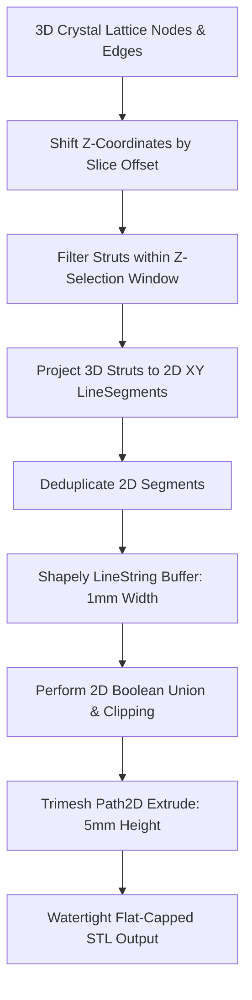

# 2D Lattice Extrusion Workflow Documentation

This document explains the design, implementation, and advantages of the **2D Polygon Extrusion Workflow** used to generate flat-capped explicit and crystal structure coasters in the Graphite engine.

---

## 1. The Problem: Voxelization & Marching Cubes Artifacts

Originally, explicit lattices (Triangle, Square, Voronoi, A15, C15) were generated using 3D cylinders composed together into a 3D mesh. When using marching cubes to voxelize these lattices:
1.  **Rough Edges**: The corners of the strut cross-sections and the intersections with the boundary frames exhibited "stair-stepping" or rough textures.
2.  **Rounded Caps**: Marching cubes could not produce perfectly flat Z-caps, leaving rough surfaces on the top and bottom faces of the coaster.
3.  **Huge Files**: The resulting voxel grids generated meshes with millions of triangles, leading to STL files exceeding **100MB** which took minutes to process and slice.

---

## 2. The Solution: 2D Projection & Extrusion

To achieve mathematically perfect flat caps, sharp corners, and lightweight files, the workflow was shifted to **2D Polygon Extrusion**:

### Steps:
1.  **Z-Selection Filtering**: For 3D crystal lattices (A15, C15), we shift the coordinates in Z by the slice offset and filter the 3D edges:
    $$\text{Keep strut } e(p_0, p_1) \iff \min(p_{0,z}, p_{1,z}) \le z_{limit} \text{ and } \max(p_{0,z}, p_{1,z}) \ge -z_{limit}$$
2.  **2D Projection**: We discard the Z-coordinates of the kept struts, leaving 2D line segments on the XY plane.
3.  **Polygon Buffering**: Each 2D segment is converted to a polygon by buffering the line with a half-width radius ($0.5$mm for $1.0$mm strut width) using `LineString.buffer(radius, cap_style=2)` (square end caps).
4.  **2D Solid Booleans**:
    *   The buffered polygons are unioned using Shapely's `unary_union`.
    *   The lattice is clipped against the inner shape boundary.
    *   For **Framed** versions, the lattice is unioned with a solid frame polygon (`outer_shape.difference(inner_shape)`).
5.  **Extrusion**: The combined 2D polygon is loaded into a `trimesh.path.Path2D` and extruded by the physical coaster height ($5.0$mm) along the Z-axis, then centered.

---

## 3. Dynamic Z-Filtering Window Scaling

When working with larger unit cell sizes (e.g., doubling C15 cell size to $50.0\text{mm}$), the node layer spacing increases ($6.25\text{mm}$).
If we keep the physical Z-filtering window fixed at $[-2.5, 2.5]\text{mm}$, the node layers at intermediate offsets (like $3.125\text{mm}$) fall outside the selection window. This leads to **hanging/floating struts** because the struts do not meet at any common node inside the filter window.

### Solution:
We scale the selection half-width ($z_{limit}$) dynamically relative to the unit cell size to keep the vertical slice proportional ($10\%$ of the cell height):
*   **A15 ($L = 25\text{mm}$)**: $z_{limit} = 2.5\text{mm}$
*   **C15 ($L = 50\text{mm}$)**: $z_{limit} = 5.0\text{mm}$

This ensures that nodes are captured, struts meet at their intersections, and the resulting 2D projection is fully connected.

---

## 4. Key Advantages

| Feature | Old 3D Marching Cubes Method | New 2D Extrusion Method |
| :--- | :--- | :--- |
| **Top/Bottom Caps** | Rough, voxelized, or warped caps | Mathematically flat, smooth caps |
| **Strut Cross-Sections** | Segmented cylinders with rough corners | Clean rectangular profiles with sharp $90^\circ$ corners |
| **File Size** | **100MB+** per STL | **< 1MB** per STL (99% reduction) |
| **Generation Speed** | ~15–30 seconds per coaster | **Instant** (< 0.1 seconds per coaster) |
| **Watertightness** | Prone to marching cubes boundary holes | Guaranteed watertight manifold |
